# 🌿 Urja-Marg: Your Path to Nourishment

**Urja-Marg** (ऊर्जा-मार्ग) is your intelligent companion for mindful eating.  
A powerful and intuitive web app that helps users **track daily food consumption**, especially focused on **Indian cuisine**, by logging meals, calculating calorie intake, and visualizing dietary progress over time.

> 🍽️ Whether it’s a spicy *Pav Bhaji*, wholesome *Khichdi*, your grandma’s *Thepla*, your homemade *dal chawal*, a quick *idli sambar*, or a celebration *biryani* we’ve got your nutrition data covered and we make every calorie count.

---

## 🔥 Why Urja-Marg?

Because we believe that **the path to energy begins with awareness**.  
This app is built to empower people with **insights into what they eat**, without making it a chore.

---

## 🧠 Tech Stack

| Tools Used |
|------------|
| React, Next.js (App Router), TailwindCSS, Radix UI |
| React Hook Form + Zod |
| Lucide Icons, CMDK, Embla Carousel, Vaul |
| Recharts for calories vs days, food category breakdowns |

---

## 📲 Core Features

✨ Smart Indian Calorie Logging  
📊 Visual Food Insights (charts by meals, days, categories)  
📝 Daily Meal Tracking 
🧮 Real-Time Calorie Totals   
📱 Mobile Responsive Design

---

## 🖼️ App Preview Screenshots
🍛 Home Dashboard
🥗 Log a New Meal
📊 Calorie Chart View

### 🖥️ **Desktop View** & 📱 **Mobile View**

| Dashboard Overview | Meal Log | Browse Category |
|--------------------|----------|-----------------|
| 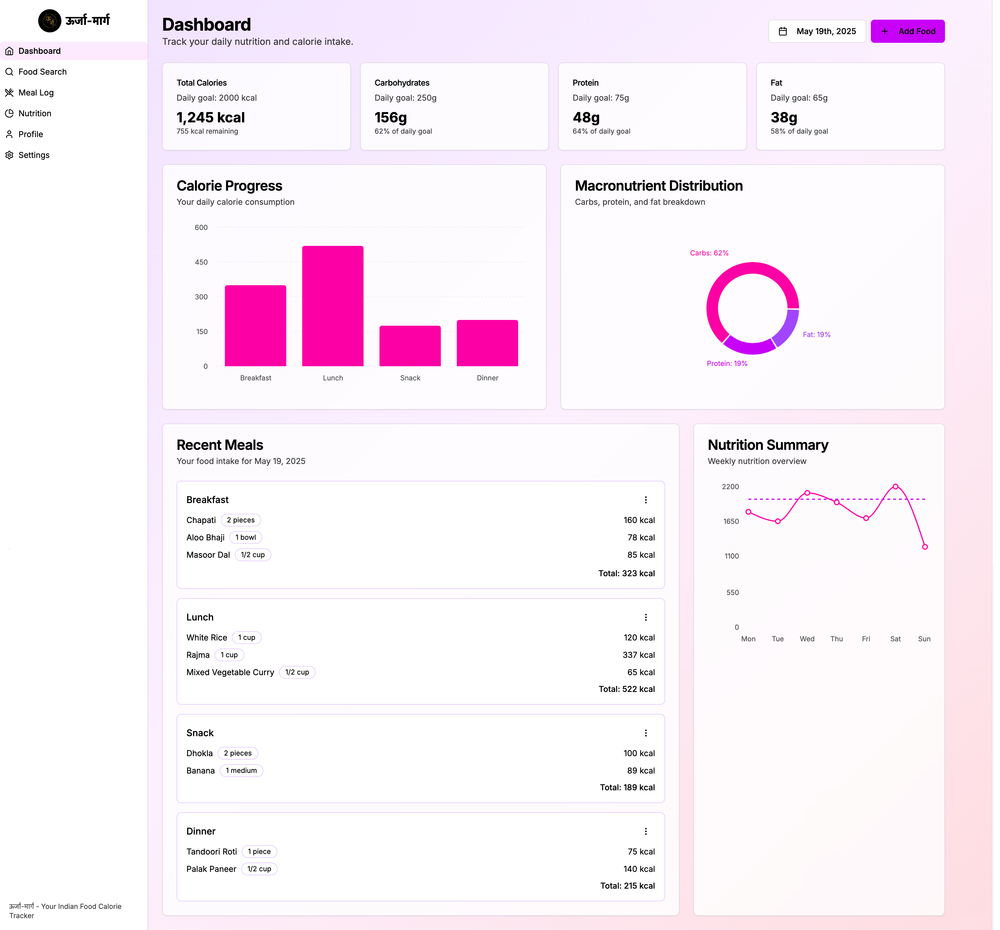 | 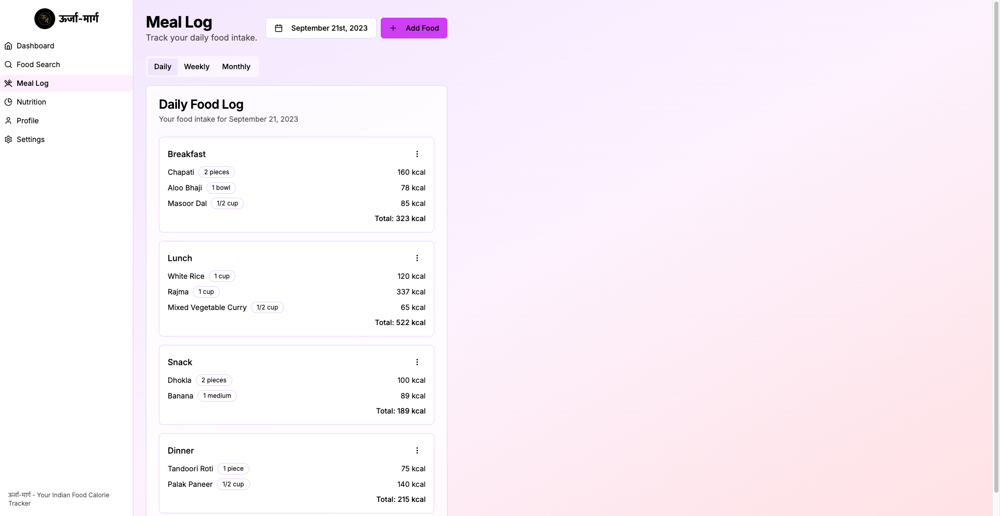 | 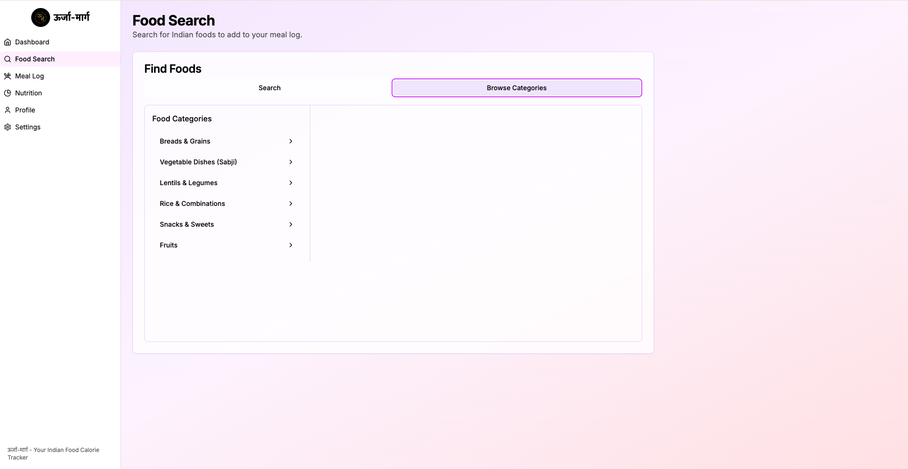 |

| Nutrition Analysis | Macronutrients | Nutrition Overview |
|--------------------|----------------|--------------------|
|  |  |  |

| General Settings | Notification Settings | Privacy Settings |
|------------------|-----------------------|------------------|
|  |  |  |

| Personal Info | Goals | Preferences |
|---------------|-------|-------------|
|  | 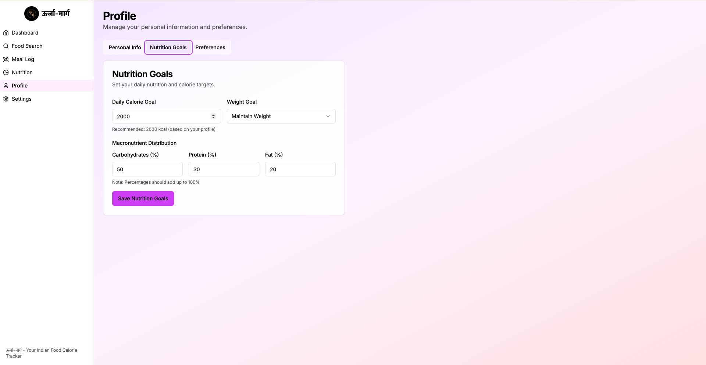 | 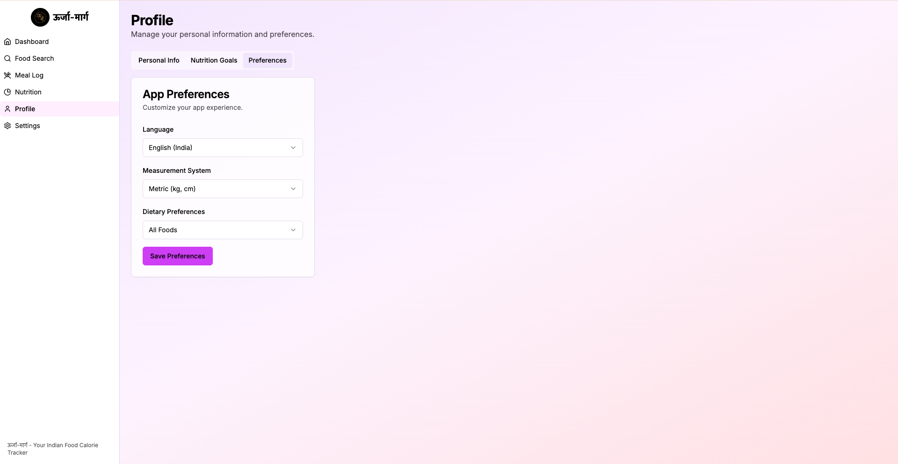 |

| Food Search |
|-------------|
| 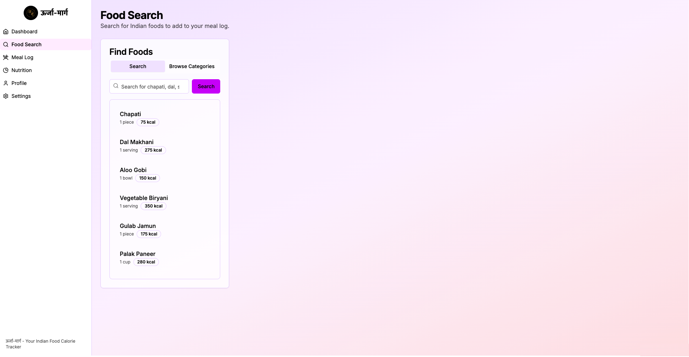 |

---

| Mobile Dashboard | Mobile Dashboard | Mobile Dashboard |
|------------------|------------------|------------------|
| 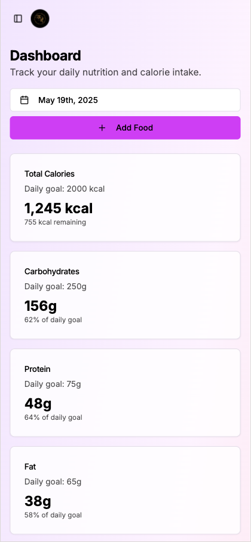 | 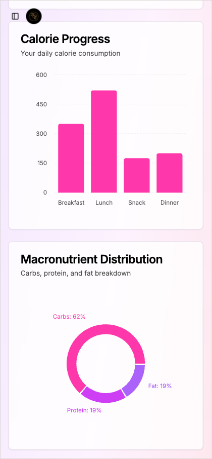 | 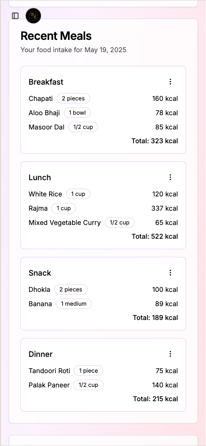 |

| Browse Category | Food Search | Add Food |
|-----------------|-------------|----------|
| 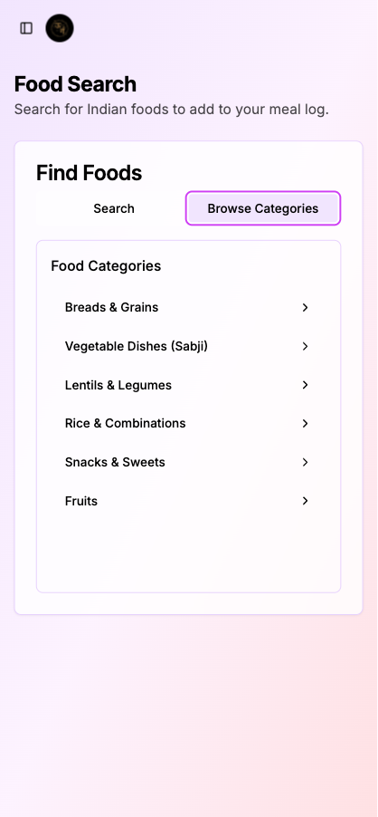 | 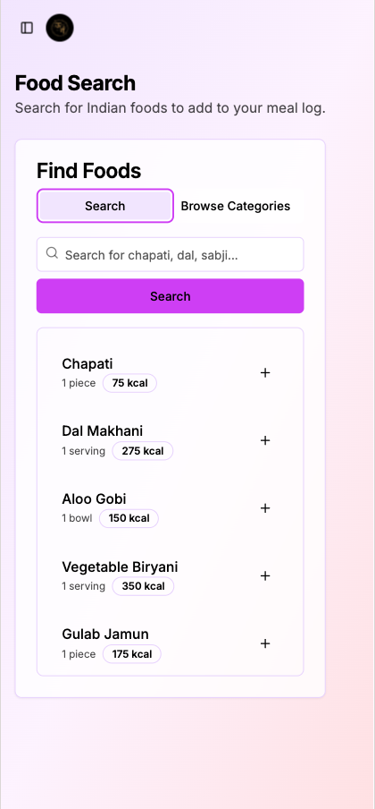 | 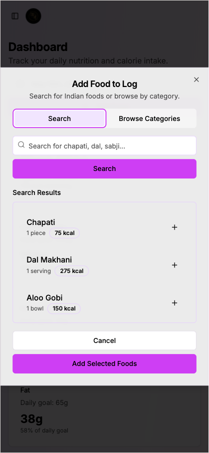 |

| Meal Log | Mobile Menu | Mobile Settings |
|----------|-------------|-----------------|
| 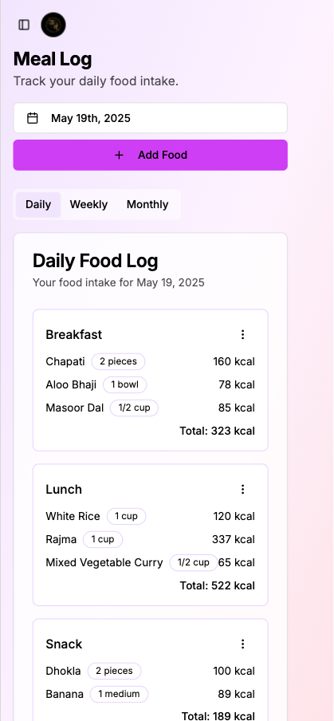 | 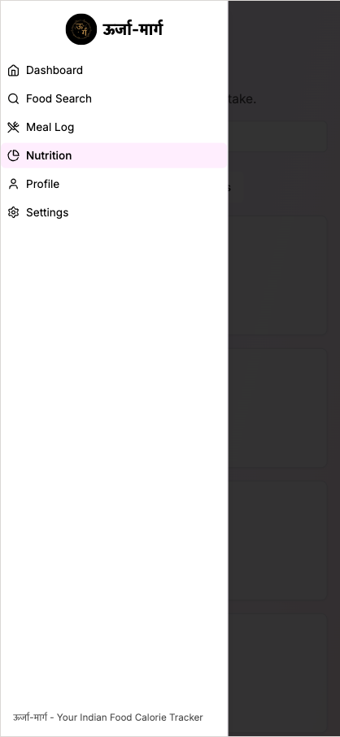 | 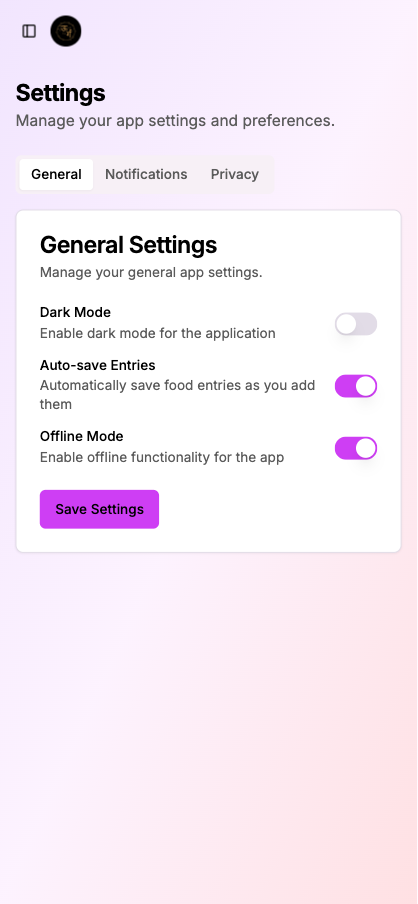 |

---

## 🔧 Setup Guide

### 1. 📁 Clone & Navigate
git clone https://github.com/k369p/Urja-Marg.git
cd urja-marg

### 2. 📦 Install Dependencies
npm install

### 3. 🚀 Start Development Server
npm run dev

---

## 🔮 What's Next
🍱 AI-based food recognition from photos 
🧘 Personalized meal plans
🗣️ 🇮🇳Indian Multilingual support (English, Hindi, Gujarati, Marathi, Punjabi, and many more...)
🧾 Integration with Indian food APIs
🛎️ Reminder notifications to log meals
🧠 AI-powered food recognition (via image)
🌘 Light / Dark Mode Support  
💬 Interactive Modals, Toasts, and Command Palette  

### 😎❤️ Crafted with chai ☕️☕ and clean code 💻 by Keval Patel